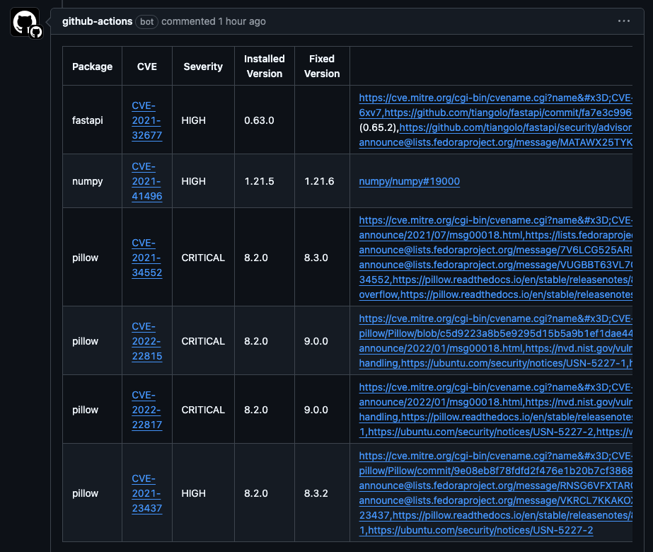
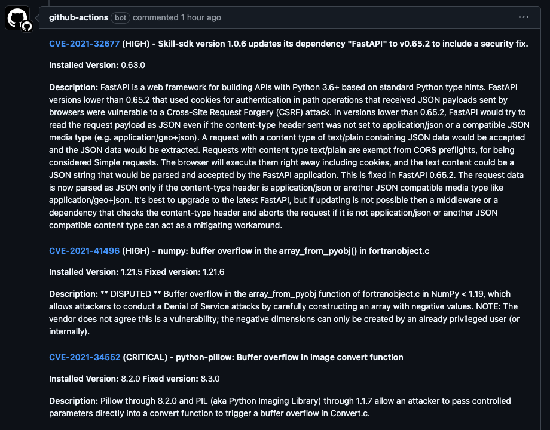

<a href="https://periphery.security/">
    
</a>

# PRivy

> A legendary journey to secure your repositories!

:star: Star us on GitHub — it motivates us a lot!

This GitHub action reports results from a
[Trivy](https://github.com/aquasecurity/trivy) vulnerability scan as GitHub PR
comments.

A PR comment will be generated listing each vulnerability in the report with the
ability to use a custom template with [handlebars](https://handlebarsjs.com/).

## Examples

### Default Template:



### Custom



## Features

- Takes any Trivy JSON output and creates a PR Comment
- Templated comments - Use [Handlebars](https://handlebarsjs.com/) templating to
  customise the output comments.
- Dry-Run mode - Allows testing without createion of issues

## Inputs

|   Parameter   | Required |          Default Value           | Description                                                              |
| :-----------: | :------: | :------------------------------: | :----------------------------------------------------------------------- |
|     token     |   True   |               N/A                | GitHub Access Token.<br>${{ secrets.GITHUB_TOKEN }} is recommended.      |
| trivy-results |   True   |               N/A                | The target filename for the Trivy report                                 |
|   template    |  False   | `templates/default-template.hbs` | A Handlebars template for formatting the comment this can also be inline |
|    dry-run    |  False   |             `false`              | If enabled, no labels or issues will be created, only logs.              |

## Example Workflow

```yaml
# .github/workflows/integration-test.yml
name: Vulnerability Scan & Generate Issues

on:
  workflow_dispatch: # Allows manual triggering of the workflow
  push:
    branches:
      - main # Or a development branch

jobs:
  test:
    permissions:
      issues: write
    runs-on: ubuntu-latest

    steps:
      - name: Checkout repository
        uses: actions/checkout@v3

      - name: Repo Trivy vulnerability scanner
        uses: aquasecurity/trivy-action@0.30.0
        with:
          scan-type: 'repo'
          severity: 'HIGH,CRITICAL'
          ignore-unfixed: true
          format: 'json'
          output: 'repo-result.json'

      - name: Analyze report and create issues
        uses: qomodo-labs/trissue@v1
        with:
          token: ${{ secrets.GITHUB_TOKEN }}
          filename: 'repo-result.json'
          create-labels: 'true'
          enable-fix-label: 'true'

      - name: Run Action - Default Template
        uses: qomodo-labs/privy@1.0.0
        with:
          token: ${{ secrets.GITHUB_TOKEN }}
          trivy-results: 'repo-result.json'

      - name: Run Action - Inline Template
        uses: qomodo-labs/privy@1.0.0
        with:
          token: ${{ secrets.GITHUB_TOKEN }}
          trivy-results: 'repo-result.json'
          template: |
            {{#each Results}}
            {{#if Vulnerabilities}}
            {{#each Vulnerabilities}}

            #### {{VulnerabilityID}} ({{Severity}}) - {{Title}}
            **Installed Version:** {{InstalledVersion}} {{#if FixedVersion}}**Fixed version:** {{FixedVersion}}{{/if}}

            **Description:** {{Description}}

            {{/each}}
            {{/if}}
            {{/each}}

      - name: Run Action - Custom Template
        uses: qomodo-labs/privy@1.0.0
        with:
          token: ${{ secrets.GITHUB_TOKEN }}
          trivy-results: 'repo-result.json'
          template: templates/my-comment-template.hbl
```
